# Appscrip Task - Dhairyasheel Balasaheb Ingale

## Overview
This repository contains the implementation of the design task specified in the Figma link. The task has been developed using **React.js** with the **Next.js** framework, showcasing my skills in building responsive and SEO-friendly web pages.

## Live Demo
The application is hosted on [Netlify](https://appscripecommerce.netlify.app/) for easy access and evaluation.

## Features
- **Server-Side Rendering (SSR):** The application utilizes SSR to enhance performance and SEO.
- **Responsive Design:** The layout is optimized for mobile and tablet devices, ensuring a seamless user experience across different screen sizes.
- **SEO Optimization:** 
  - Configured page title and description.
  - Proper usage of H1 and H2 tags.
  - Implemented schema settings for improved search visibility.
  - Used images with SEO-friendly names and appropriate alt text.
- **Mock API Integration:** Data is fetched from [Fake Store API](https://fakestoreapi.com/) to demonstrate dynamic content rendering.
- **Minimal Dependencies:** The project employs minimal pre-built JavaScript packages for efficiency.

## Structure
- The project follows a modular structure, promoting maintainability and scalability. Code quality is prioritized with clear naming conventions.

## Getting Started
1. Clone the repository:
   ```bash
   git clone https://github.com/your-username/Appscrip-task-Dhairyasheel-Balasaheb-Ingale.git

2. Navigate to the project directory:
  
       cd Appscrip-task-Dhairyasheel-Balasaheb-Ingale

3. Install dependencies:

       npm install

4. Run the development server:
    
       npm run dev

   The application will be running at http://localhost:3000.


 ## Build for Production

   To create an optimized production build:

    npm run build

   After the build is complete, you can start the production server:
    
    npm run start

## Deployment
You can deploy this project on Netlify, Vercel, or any other static hosting service by following the respective deployment steps.

## SEO Settings
- The project includes the following SEO optimizations:

- Page Title: Defined for better search engine visibility.

- Meta Description: Helps with indexing and provides a summary of the page.

- H1 and H2 tags: Proper usage of heading tags for content structure.

- Schema Settings: Implemented to improve search visibility and understanding.

- Image Optimization: Used descriptive, SEO-friendly image names and appropriate alt text for all images.


## Technologies Used
- React.js with Next.js

- CSS3 for styling

- Fake Store API for mock data integration

- Server-Side Rendering (SSR)

- Responsive Design

## Conclusion
Thank you for reviewing my submission. I look forward to your feedback!

## Web Page Screenshots
   **Home Page**
   
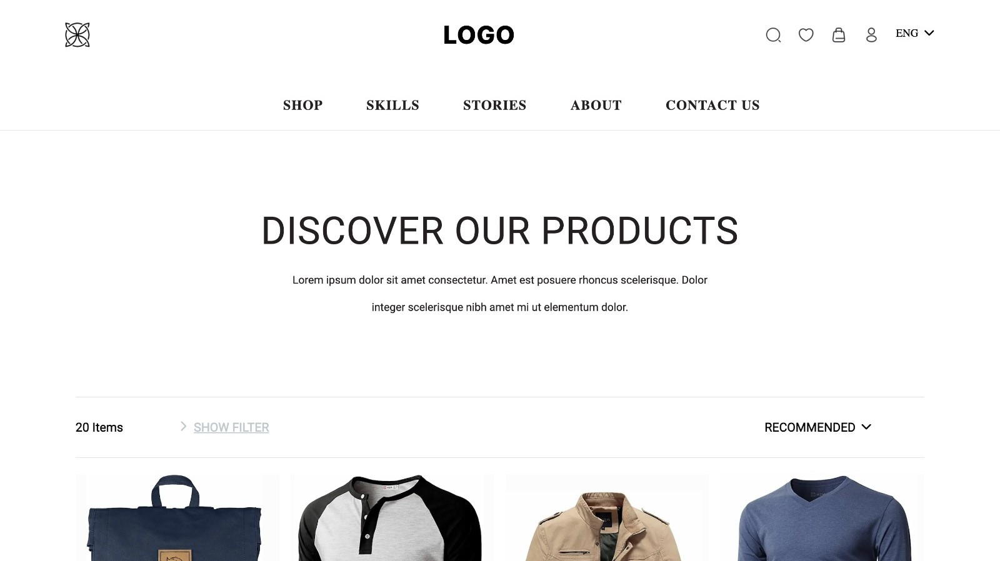

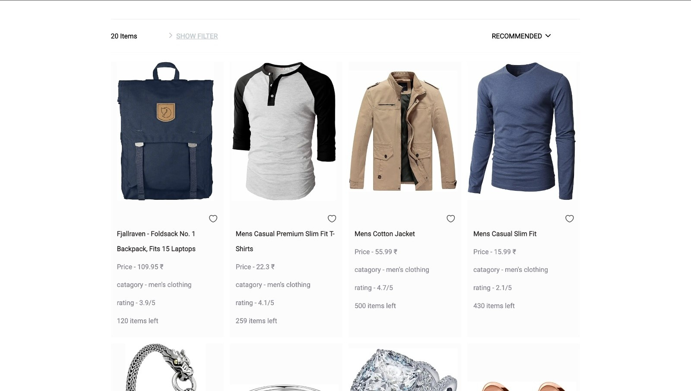

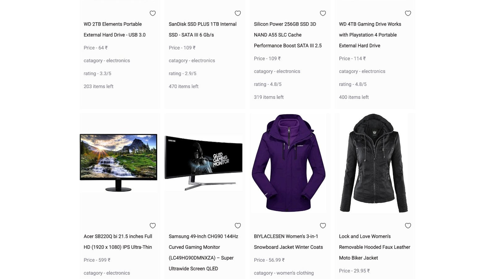

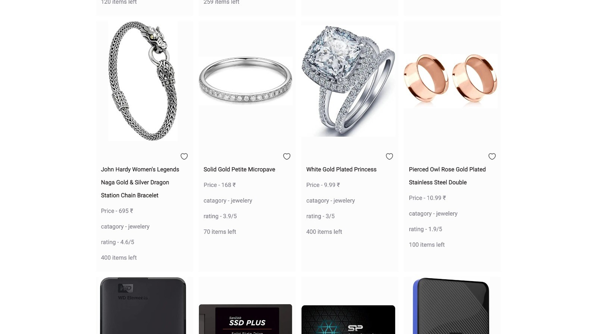

**

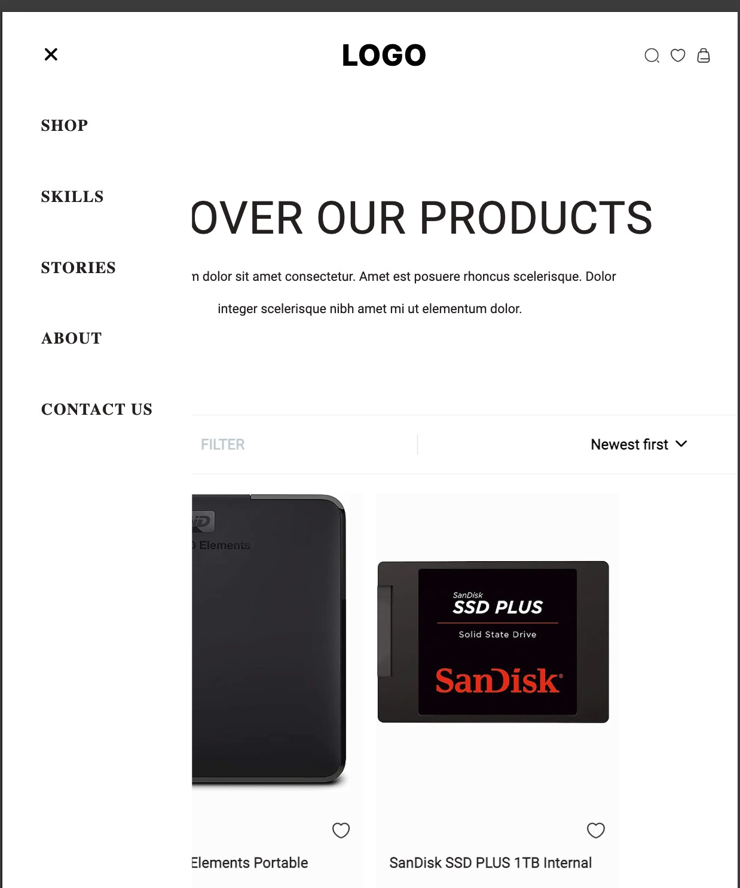

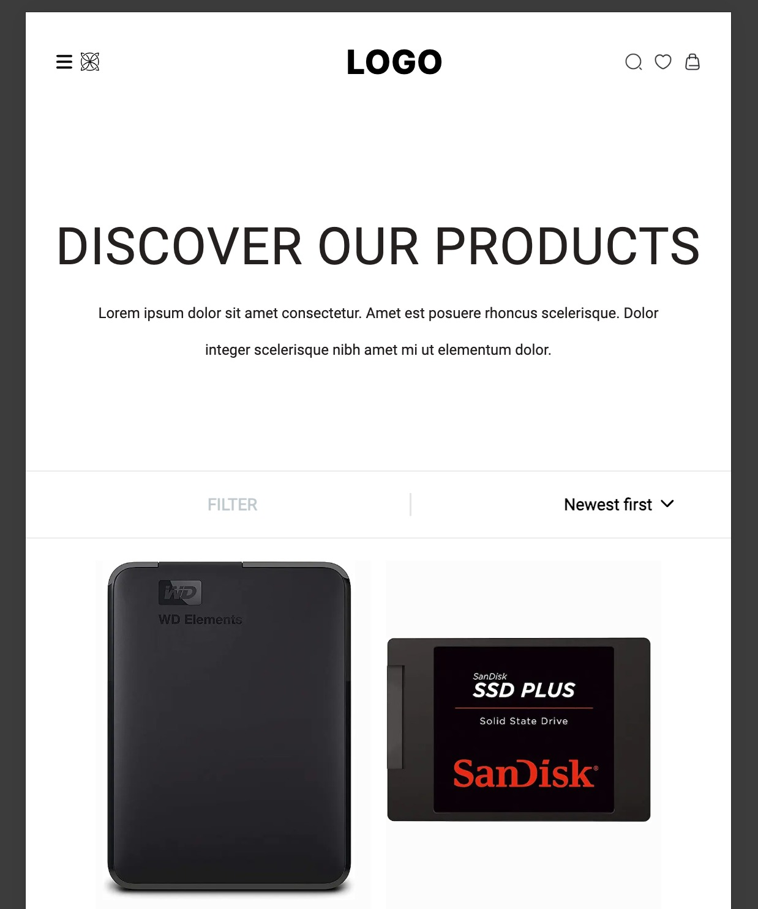

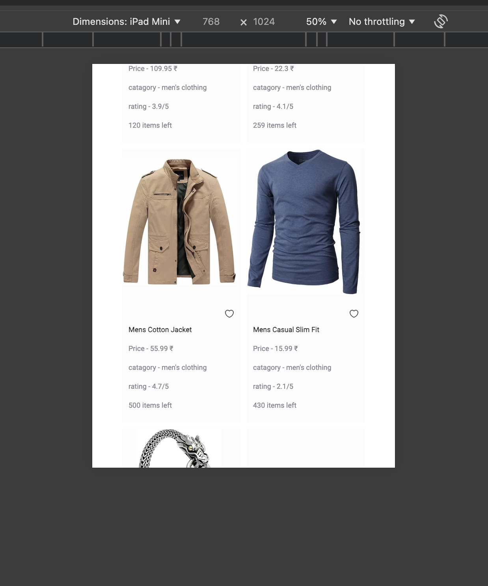

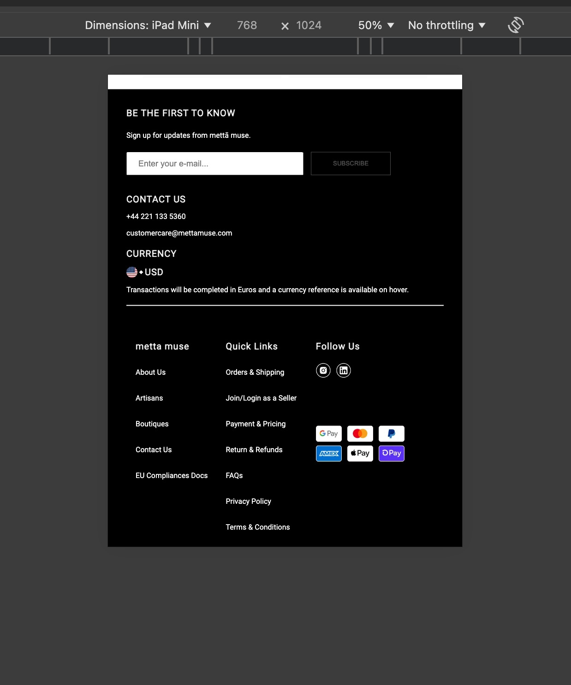

**Mobile View(IPhone SE)**

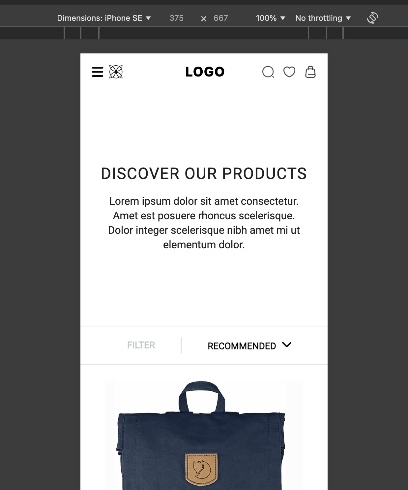

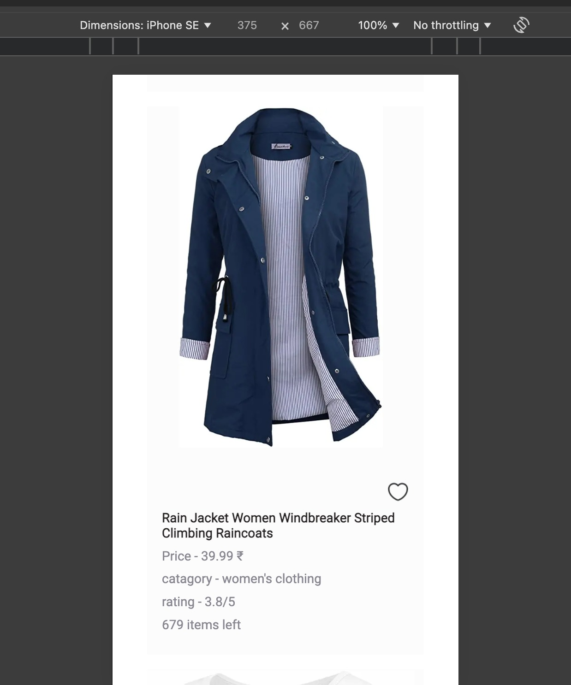

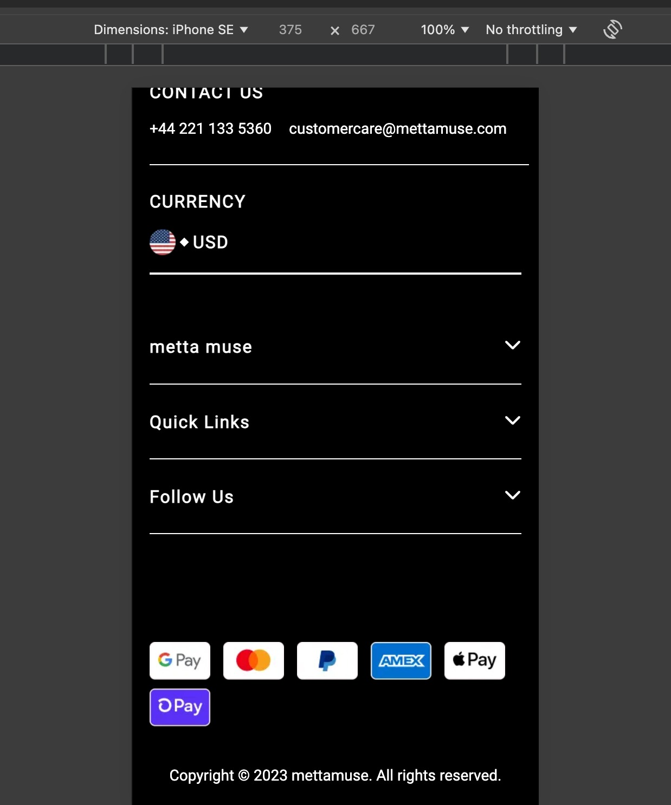


  


